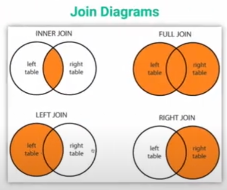

# SQL databases

## Introduction

PostgreSQL can be isntalled in Linux by running sudo apt install postgresql
sudo service postgresql start

psql is the tool used to connect to the database.
To create the user on PostgrSQL:
sudo -u postgres createuser -s <username>; createdb 

Notedsome differences from the version used in the course and the version in WSL.
Specially creating user and creating a database. Service is already started by default.

Quick commands:  
\c \<database\> = connect to database  
\dt = list all tables
\d \<table\> = show the details of the table structure  
\dg = list all users/roles  
\x auto = change the display format to better see content  

## Data Manipulation - CRUD
Basic tasks, DML (Data Manipulation Language): opposed t DDL (Data Definition Language) used to create and define the structure of the database
Select, add, update, delete

    - Creating data in the database  
        INSERT INTO

    - Read data from the database  
        SELECT FROM  
        SELECT * FROM books;
        SELECT title FROM books;
        SELECT title, author FROM books;
        Can complemented with WHERE that will accept:  
            regular operators < > >= = !=   
            binary with AND OR, IN ( , , , ), BETWEEN = ... BETWEEN 20 AND 25  
            LIKE = define a pattern to search for a part of a string, if we are unsure about the exact value  
                'a%'  '_b_' '% % %' = name with 3 strings
            ILIKE case insensitive POSTGRESQL only, not part of SQL.

        Aggregator functions  
        SELECT MAX(price) from books;

        Group by clause - requires the use of an aggregator function on the selection.
        SELECT author, COUNT(*) FROM books GROUP BY author

        HAVING clause
        Complementary to the selection, filters down the results after the WERE statement. Should be filtering from one of the items in teh select clause.  
        like were but works with grouped results. 
        SELECT author, AVG(page_count) FROM books GROUP BY author HAVING AVG(page_count)>50;

        ORDER BY  
        Define an ordering definition to the results and can be ascending or descending.  
        SELECT id, author FROM books ORDER BY author desc;  
        Allows additional criteria for sorting, to solve ties on the first order:   
        ORDER BY author, title

        LIMIT  
        to limit the results to the reults to the top most items.
        .. ORDER BY price LIMIT 2;

        OFFSET
        Allows to skip n number of records (to load additional pages)
        ... ORDER BY price LIMIT 2 OFFSET 2 (will show results 3 and 4)

        ALIAS  
        SELECT author AS Autores FROM books GROUP BY author;  
        The alias can also be used in the same query.

    - Adding new entries to the table.  
        INSERT INTO books (autor, title, price) VALUES ('Fabricio', 'mey Livro', 50.32);
        VALUES can have multiple entries, just send multiple groups following the same order of values

    - Modyfying entries from the table  
        UPDATE books SET author = 'Fabricio' WHERE author = 'J. K. Rowling';
        If we do not specify a WHERE, all entries in teh table will be overwritten.

    - Removing an entry from the table
        DELETE FROM
        DELETE FROM books WHERE page_count > 500;

## Data relationship

What makes a database relational.
How to correlated data on multiple tables.

Primary key, is the unique identified for an entry in a table, usually the id column, but can be anything, and should be unique.
Foreign key, is a reference for a primary key from another table. And we can force the foreign key to be an actual valid key from the secundary table.
1:M one to many relationship, a referencing table to a referenced table.

With a foreign key, inserting new data requires the usage of a valid key number, and deleting is only allowed if no other entry is refering to the entry we want to delete.

- Joining Tables  
    Process to unify results from different tables.
    Requires the use of a primary key and foreign key (the same key, but from different tables). It creates a new table in memory to compile the data.  
    SELECT title, name FROM movies JOIN studios ON movies.studio_id = studios.id (in this exaple title comes from movie table, name comes fromstudio table.)  

    This is actually an INNER JOIN, but INNER is option in the query

    - OUTER JOIN  
          
        WE can use LEFT JOIN, RIGHT JOIN according to the diagram above to select additional items from either the left or right table that may not have a matching entry in theothertable.

- Many to many relationsip  
    In the many to many relation ship there is usually a third table that binds the ids from other 2 tables, allowing the multiple crossed references.  
    The joining table sometimes has additional information, butnot necessarily.  
    SELECT * FROM roles JOIN actors ON roles.actor_id = actor_id JOIN movies ON roles.movies_id = movies.id;  
    We can use instead of the *, the actual fields we want to see.  

    WE can als use alias for better identify whre the information is coming from:  
    SELECT m.title, a.first_name, a.last_name FROM moviesm JOIN roles r ON m.id = r.movie_id JOIN actors a ON r.actor_id = a.id;

## Data Definition DDL

Commands used to create a database, create tables, defining fields and types, restrictions and correlation between tables.  
We can have a default value for a non null field.

REferences will look for a column called id by default, or we candefine which field  
REFERENCE users(username)

We can also defini delete restrictions, or behaviors in case of a delete command to either null all references to the entry, or concatanate the delete process and erase all entries that have references to the entry being deleted.  
ON DELETE SET NULL  
ON DELETE CASCADE

Tables can be modified using the ALTER command  
ALTER TABLE names RENAME COLUMN first_name TO username

Crow's Foot Notaton, usedto build the database diagram,  to be used as reference to build the commands, and keep a map of the database structure.  
Some online toos for this job would include Database Dagram Online, Gliffy, Quick DBD

## Index

Used to create a fast searching index from a column (or more) from the tatble
CREATE INDEX index_name ON users (name, username)

All primary key and unique columns already creates an index for them.

To delete DROP INDEX index_name